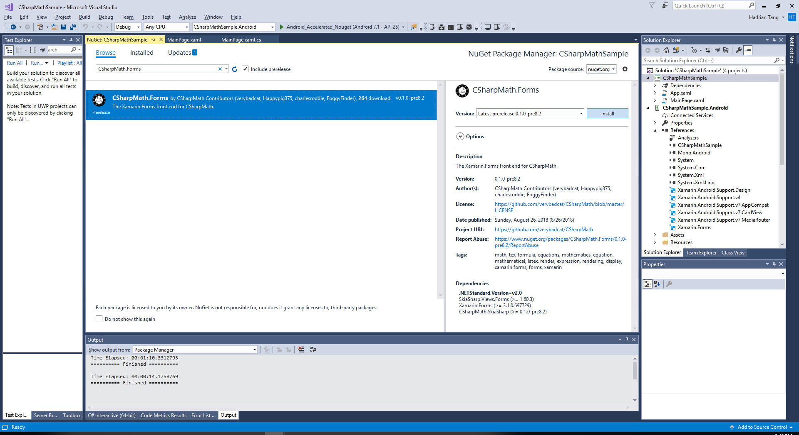
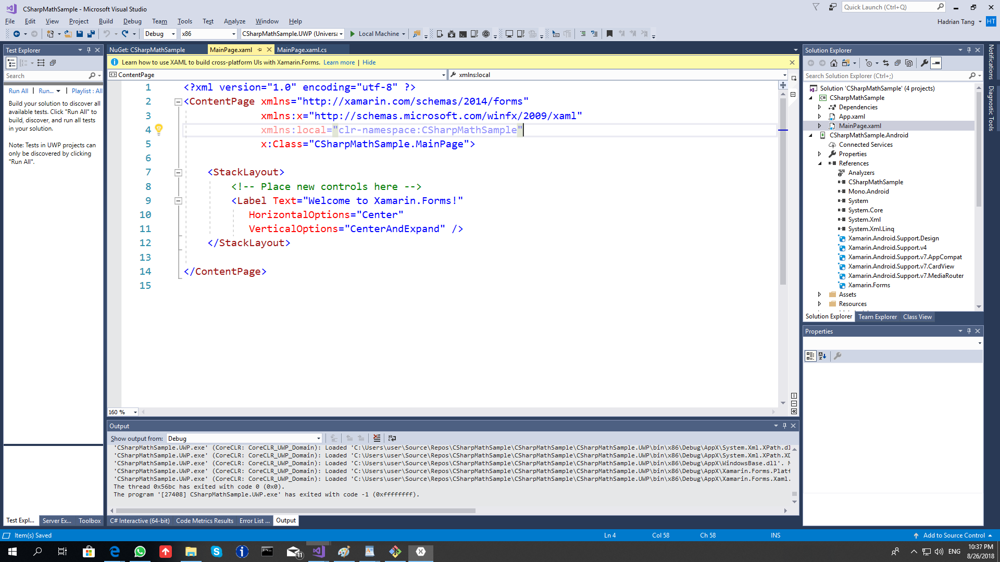
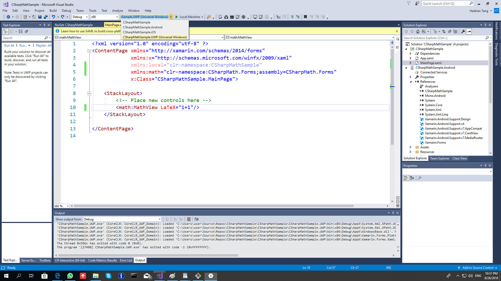
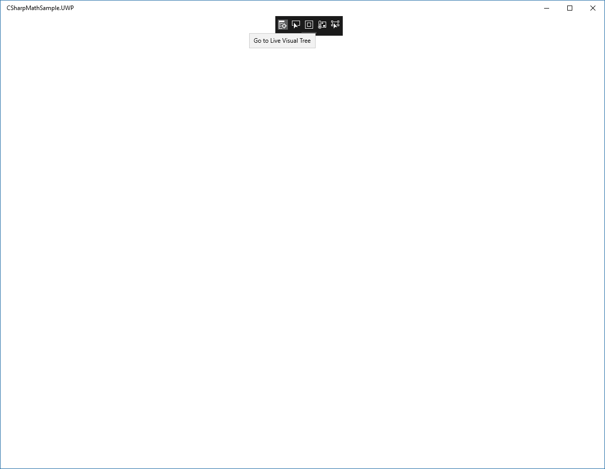
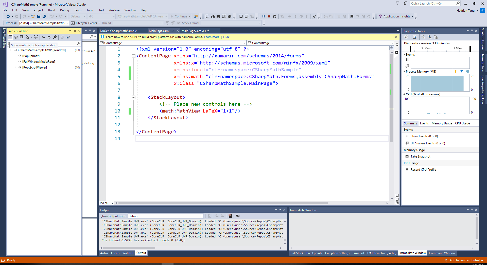
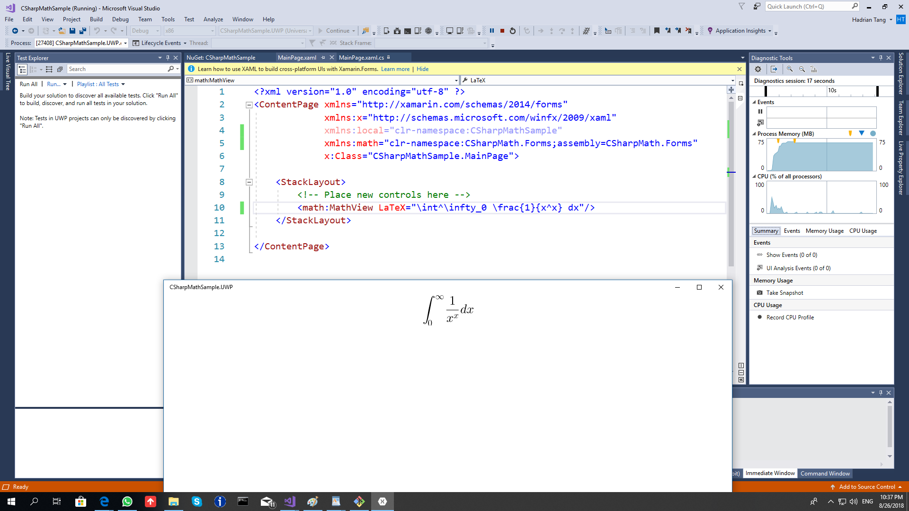

Getting Started with Xamarin.Forms
----------------------------------

Inside Visual Studio,

1. Create a Xamarin.Forms project.
We recommend choosing .NET Standard as the code sharing strategy as you will
only need to install CSharpMath once.

2. Install the CSharpMath.Forms NuGet package to the shared project if you
chose .NET Standard as the code sharing strategy, or to all the platform projects
if you chose Shared Project as the code sharing strategy.


3. Open MainPage.xaml of the shared project.


4. Insert `xmlns:math="clr-namespace:CSharpMath.Forms;assembly=CSharpMath.Forms"`
into the attributes of the ContentPage and replace the Label with `<math:MathView LaTeX="1+1"/>`
so that the file now becomes
```xaml
<?xml version="1.0" encoding="utf-8" ?>
<ContentPage xmlns="http://xamarin.com/schemas/2014/forms"
             xmlns:x="http://schemas.microsoft.com/winfx/2009/xaml"
             xmlns:local="clr-namespace:CSharpMathSample"
             xmlns:math="clr-namespace:CSharpMath.Forms;assembly=CSharpMath.Forms"
             x:Class="CSharpMathSample.MainPage">

    <StackLayout>
        <!-- Place new controls here -->
        <math:MathView LaTeX="1+1"/>
    </StackLayout>

</ContentPage>
```

5. Choose a platform project.
UWP is recommended if you are on Windows 10 and included it when creating the project.


6. Run it by clicking the button with the green arrow.


7. On UWP, a black bar appears and shadows our MathView.
You can disable it with the following buttons:


(The button is to the left)



8. [Discover what you can do](@Introduction)

