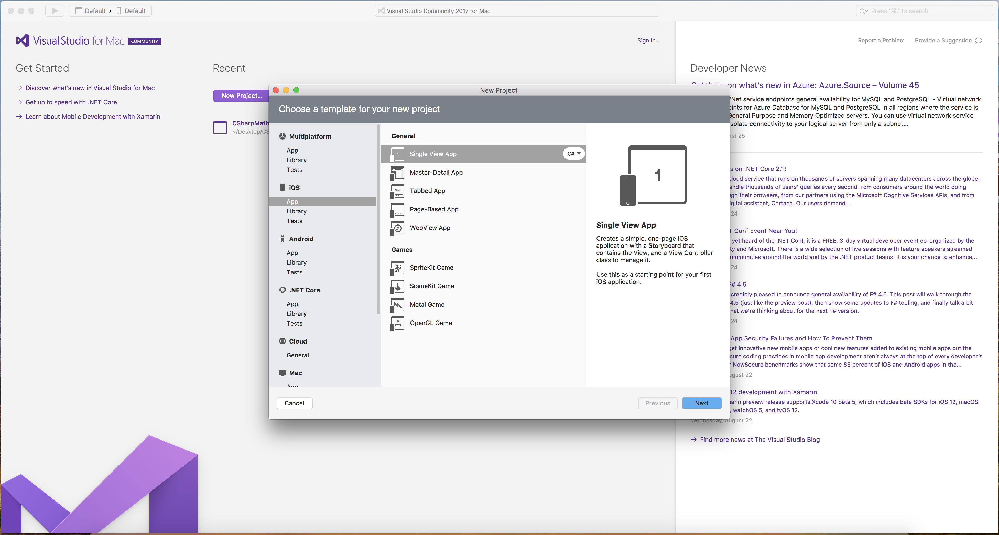
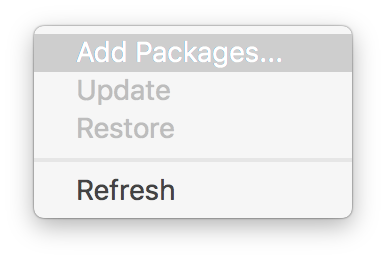
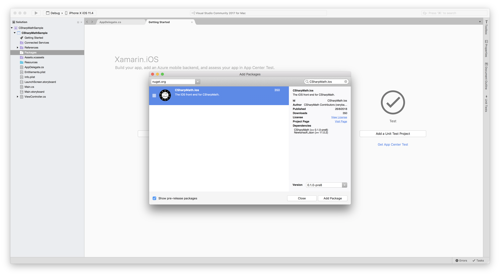
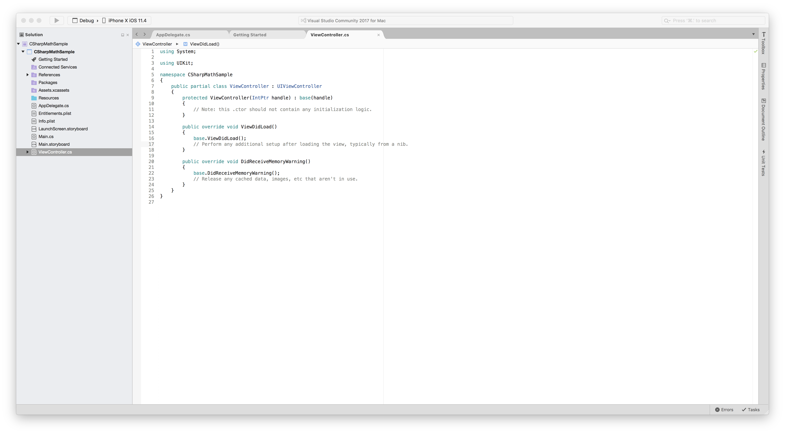
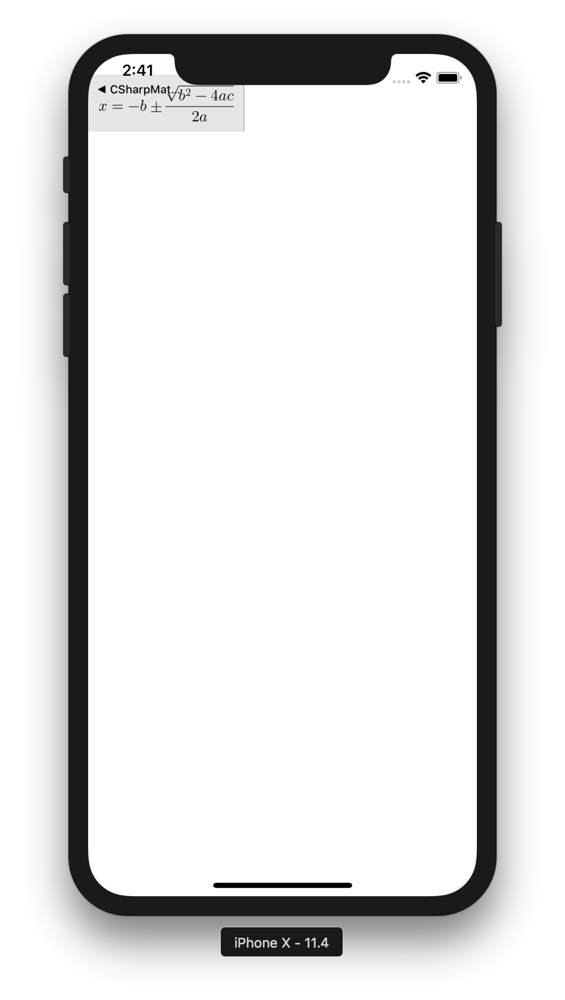

Getting Started with Xamarin.iOS
--------------------------------
Visual Studio for Mac is recommended because the iOS Simulator comes free of charge!

1. Create a Xamarin.iOS project. Choose a Single View App to start.



2. After going through the configuration window, open the `Add Packages...` window and install CSharpMath.Ios.




3. After installation, open ViewController.cs.



4. Add
```cs
var latexView = CSharpMath.Ios.IosMathLabels.MathView(@"x = -b \pm \frac{\sqrt{b^2-4ac}}{2a}", 15);
latexView.ContentInsets = new UIEdgeInsets(10, 10, 10, 10);
var size = latexView.SizeThatFits(new CoreGraphics.CGSize(370, 180));
latexView.Frame = new CoreGraphics.CGRect(new CoreGraphics.CGPoint(0, 20), size);
this.Add(latexView);
```
below 
`// Perform any additional setup after loading the view, typically from a nib.` under the `ViewDidLoad()` method.


5. Click the arrow button to run.



6. [Discover what you can do](@Introduction)