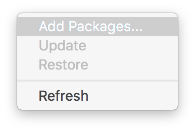
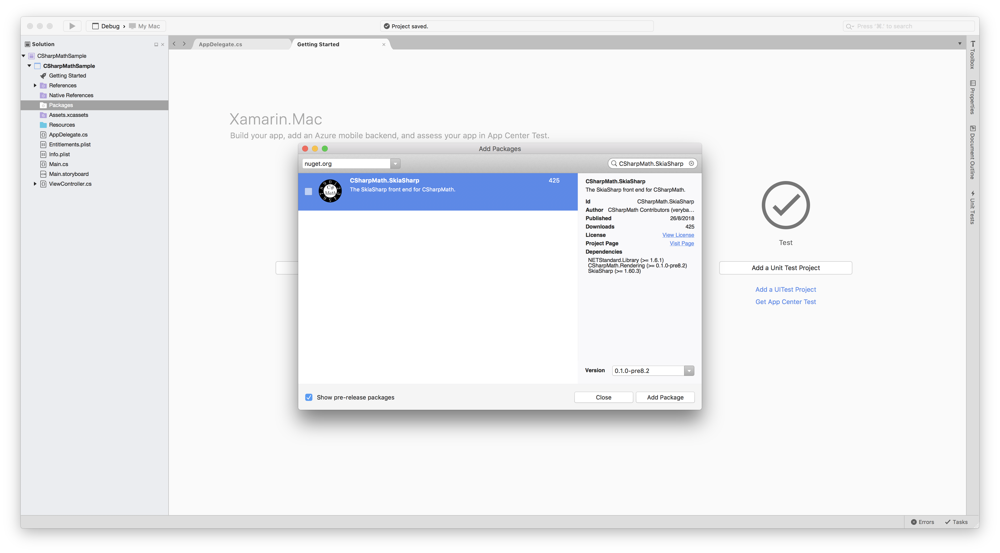
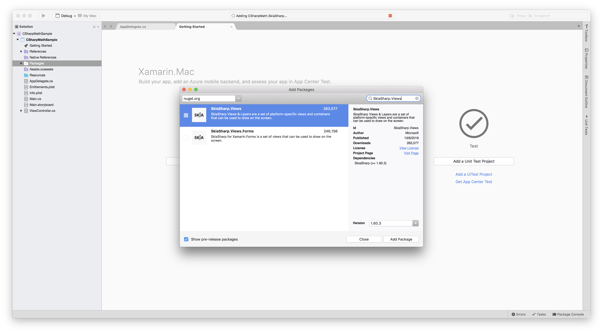
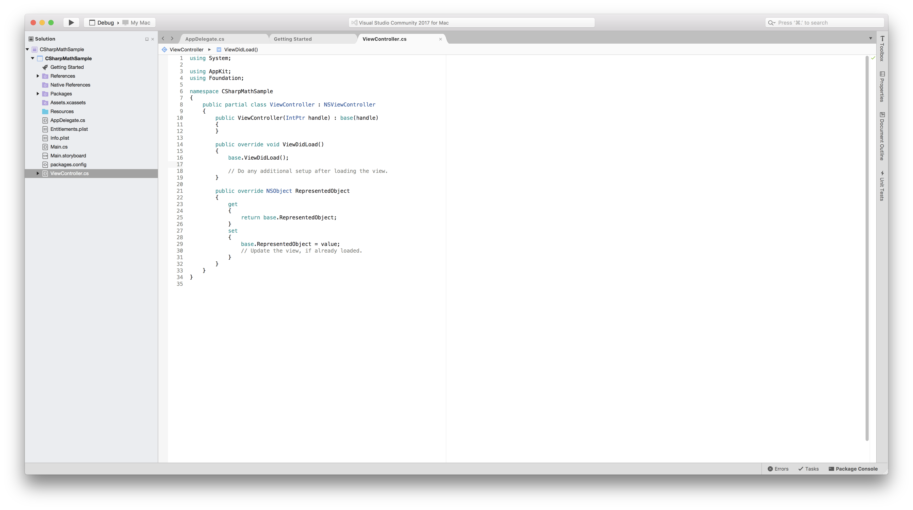
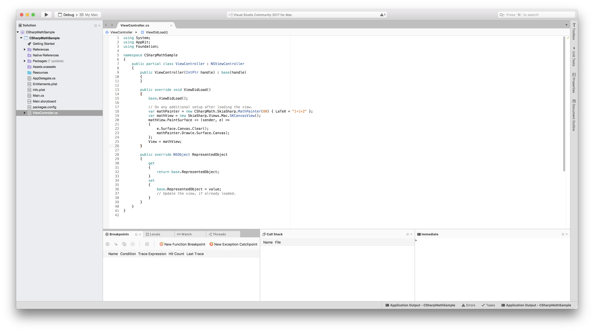
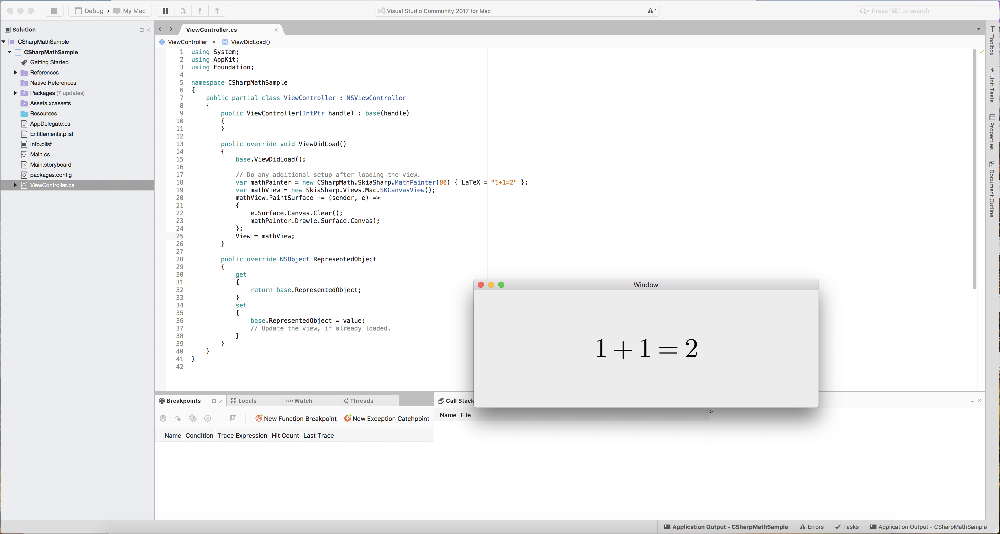

Getting Started with Xamarin.watchOS
------------------------------------


(This page is work in progress)

1. Create a Xamarin.iOS project. Choose a Single View App to start.


2. After going through the configuration window, open the `Add Packages...` window and install CSharpMath.SkiaSharp and SkiaSharp.Views.





3. After installation, open ViewController.cs.



4. Add
```cs
var mathPainter = new CSharpMath.SkiaSharp.MathPainter(80) { LaTeX = "1+1=2" };
var mathView = new SkiaSharp.Views.Mac.SKCanvasView();
mathView.PaintSurface += (sender, e) =>
{
    e.Surface.Canvas.Clear();
    mathPainter.Draw(e.Surface.Canvas);
};
View = mathView;
```
below 
`// Do any additional setup after loading the view.` under the `ViewDidLoad()` method.



5. Click the arrow button to run.



6. [Discover what you can do](@Introduction)