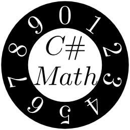
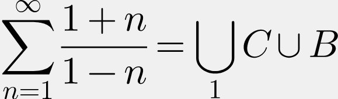

<h3 align="center">Cross-platform LaTeX rendering!</h3>

<p align="center">
<br/><br/><br/>
CSharpMath is a C# port of the wonderful <a href="https://github.com/kostub/iosMath">iosMath LaTeX engine</a>.<br/>
<i>The icon is a product of this library.</i>
</p>

[Current release][NuGet]|[][NuGet] [][GitHub] [][GitHub] [][GitHub]
-|-
[Current prerelease][NuGet-pre]|[][NuGet-pre] [][GitHub-pre] [][GitHub-pre] [][GitHub-pre]
<!-- The "Current nightly" badge is blocked on https://github.com/badges/shields/pull/4184 -->

[][NuGet] [](https://github.com/verybadcat/CSharpMath/graphs/contributors) [](https://github.com/verybadcat/CSharpMath/blob/master/License) [](https://github.com/verybadcat/CSharpMath/commits/master) [ [ [](https://codecov.io/github/verybadcat/CSharpMath?branch=master)

[](http://isitmaintained.com/project/verybadcat/CSharpMath "Average time to resolve an issue") [](http://isitmaintained.com/project/verybadcat/CSharpMath "Percentage of issues still open") [](https://github.com/verybadcat/CSharpMath/issues) [](https://github.com/verybadcat/CSharpMath/issues) [](https://www.youtube.com/watch?v=dQw4w9WgXcQ "")

[NuGet]: https://www.nuget.org/packages/CSharpMath/
[NuGet-pre]: https://www.nuget.org/packages/CSharpMath/absoluteLatest
[GitHub]: https://github.com/verybadcat/CSharpMath/releases/latest
[GitHub-pre]: https://github.com/verybadcat/CSharpMath/releases

 <!--
## Choose your platform
Really, any one you like!

[//]: # (Primary platforms)

[SkiaSharp](wiki/@GettingStarted~SkiaSharp.md)
[Xamarin.Forms](wiki/@GettingStarted~Forms.md)
[Xamarin.iOS](wiki/@GettingStarted~iOS.md)

[//]: # (Through SkiaSharp)

[tvOS](wiki/@GettingStarted~tvOS.md)
[watchOS](wiki/@GettingStarted~watchOS.md)
[Xamarin.Android](wiki/@GettingStarted~Android.md)
[Xamarin.Mac](wiki/@GettingStarted~Mac.md)
[.NET Core](wiki/@GettingStarted~NetCore.md)
[Windows Forms](wiki/@GettingStarted~WinForms.md)
[Windows Presentation Framework](wiki/@GettingStarted~WPF.md)
[Universal Windows Platform](wiki/@GettingStarted~UWP.md)
[Gtk#](wiki/@GettingStarted~Gtk.md)
[Tizen](wiki/@GettingStarted~Tizen.md)

[//]: # (Future)

[Unity](wiki/@GettingStarted~Unity.md)
[ASP.NET](wiki/@GettingStarted~ASP.md)
-->

# Platform support

iOS (CSharpMath.Ios) was ironically the first front end, which was added in v0.0.

Xamarin.Forms (CSharpMath.Forms) support via SkiaSharp (CSharpMath.SkiaSharp) was added in v0.1 as development continued.

Avalonia (CSharpMath.Avalonia) support was also added in v0.4.

For Windows platforms, use https://github.com/ForNeVeR/wpf-math.

For Unity3D, use https://assetstore.unity.com/packages/tools/gui/texdraw-51426. (paid: USD$50)

_The above projects are independent of CSharpMath._

# Usage and Examples

To get started, do something like this:

### 1. CSharpMath.Ios

```cs
var latexView = IosMathLabels.MathView(@"x = -b \pm \frac{\sqrt{b^2-4ac}}{2a}", 15);
latexView.ContentInsets = new UIEdgeInsets(10, 10, 10, 10);
var size = latexView.SizeThatFits(new CoreGraphics.CGSize(370, 180));
latexView.Frame = new CoreGraphics.CGRect(0, 20, size.Width, size.Height);
someSuperview.Add(latexView);
```

[See an example project](CSharpMath.Ios.Example)
      
|
------------------------------------------------------------------------|-----------------------------------------------------------
         |
    
### 2. CSharpMath.SkiaSharp
```cs
var painter = CSharpMath.SkiaSharp.MathPainter();
painter.LaTeX = @"\frac\sqrt23";
paiinter.Draw(someCanvas);
```
This is used by CSharpMath.Forms below.
    
### 3. CSharpMath.Forms

```xaml
<ContentPage xmlns="http://xamarin.com/schemas/2014/forms"
             xmlns:math="clr-namespace:CSharpMath.Forms;assembly=CSharpMath.Forms"
             x:Class="Namespace.Class">
    <math:MathView x:Name="View" HorizontalOptions="FillAndExpand" VerticalOptions="FillAndExpand">
        \frac\sqrt23
    </math:MathView>
</ContentPage>
```
or:
```cs
var view = new CSharpMath.Forms.MathView();
view.HorizontalOptions = view.VerticalOptions = LayoutOptions.FillAndExpand;
view.LaTeX = @"\frac\sqrt23";
someLayout.Children.Add(view);
```

[See an example project](CSharpMath.Forms.Example)
    
iOS | Android | Windows UWP
----|---------|------------
 |  |  

### 4. CSharpMath.Avalonia

```xaml
<UserControl xmlns="https://github.com/avaloniaui"
             xmlns:math="clr-namespace:CSharpMath.Avalonia;assembly=CSharpMath.Avalonia"
             x:Class="Namespace.Class">
    <math:MathView LaTeX="x + 2 \sqrt{x} + 1 = (\sqrt x+1)^2" />
</UserControl>
```
or:
```cs
var view = new CSharpMath.Avalonia.MathView();
view.LaTeX = @"\frac\sqrt23";
somePanel.Children.Add(view);
```

[See an example project](CSharpMath.Avalonia.Example)


## But I want a button instead!

For Xamarin.Forms, you can make use of `CSharpMath.Forms.MathButton` to make a clickable math button. It wraps a `MathView` inside and will use its properties to draw math on the button.
```xaml
<ContentPage xmlns="http://xamarin.com/schemas/2014/forms"
             xmlns:math="clr-namespace:CSharpMath.Forms;assembly=CSharpMath.Forms"
             x:Class="Namespace.Class">
    <math:MathButton x:Name="MathButton">
        <math:MathView x:Name="MathView">
            \frac\sqrt23
        </math:MathView>
    </math:MathButton>
</ContentPage>
```
For Avalonia, `Avalonia.Controls.Button` already supports arbitrary content. Use it instead.
```xaml
<UserControl xmlns="https://github.com/avaloniaui"
             xmlns:math="clr-namespace:CSharpMath.Avalonia;assembly=CSharpMath.Avalonia"
             x:Class="Namespace.Class">
    <Button x:Name="MathButton">
        <math:MathView x:Name="MathView">
            \frac\sqrt23
        </math:MathView>
    </Button>
</UserControl>
```

## But I want to display a majority of normal text with a minority of math!
CSharpMath also provides a `TextView` exactly for this purpose. You can use `$`, `\(` and `\)` to delimit inline math and `$$`, `\[` and `\]` to delimit display math.
There is also a `TextButton` for the Xamarin.Forms equivalent of `MathButton`.
Xamarin.Forms:
```xaml
<ContentPage xmlns="http://xamarin.com/schemas/2014/forms"
             xmlns:math="clr-namespace:CSharpMath.Forms;assembly=CSharpMath.Forms"
             x:Class="Namespace.Class">
    <math:TextView LaTeX="Text text text text text \( \frac{\sqrt a}{b} \) text text text text text" />
</ContentPage>
```
Avalonia:
```xaml
<UserControl xmlns="https://github.com/avaloniaui"
             xmlns:math="clr-namespace:CSharpMath.Avalonia;assembly=CSharpMath.Avalonia"
             x:Class="Namespace.Class">
    <math:TextView LaTeX="Text text text text text \( \frac{\sqrt a}{b} \) text text text text text" />
</UserControl>
```
Xamarin.Forms|Avalonia
-|-
|

## What about rendering to an image instead of displaying in a view?
Warning: There are still some rough edges on image rendering to be resolved, such as [this](CSharpMath.Rendering.Tests/MathDisplay/AccentOverF.png) and [this](CSharpMath.Rendering.Tests/TextLeft/WideDisplayMaths.png). However, it is already usable for the majority of cases.

For SkiaSharp:
```cs
using CSharpMath.SkiaSharp;
var painter = new MathPainter { LaTeX = @"\frac23" }; // or TextPainter
using var png = painter.DrawAsStream();
// or painter.DrawAsStream(format: SkiaSharp.SKEncodedImageFormat.Jpeg) for JPEG
// or painter.DrawAsStream(format: SkiaSharp.SKEncodedImageFormat.Gif) for GIF
// or painter.DrawAsStream(format: SkiaSharp.SKEncodedImageFormat.Bmp) for BMP
// or... you get it.
```
For Xamarin.Forms:
```cs
using CSharpMath.SkiaSharp;
var painter = someMathView.Painter; // or someTextView.Painter
using var png = painter.DrawAsStream();
// or painter.DrawAsStream(format: SkiaSharp.SKEncodedImageFormat.Jpeg) for JPEG
// or painter.DrawAsStream(format: SkiaSharp.SKEncodedImageFormat.Gif) for GIF
// or painter.DrawAsStream(format: SkiaSharp.SKEncodedImageFormat.Bmp) for BMP
// or... you get it.
```
For Avalonia:
```cs
using CSharpMath.Avalonia;
var painter = someMathView.Painter; // or someTextView.Painter
// Due to limitations of the Avalonia API, you can only render as PNG to a target stream
painter.DrawAsPng(someStream);
```

||
-|-|-
||
||


## This looks great and all, but is there a way to edit and evaluate the math?
Yes! You can use a `CSharpMath.Rendering.FrontEnd.MathKeyboard` to process key presses and generate a `CSharpMath.Atom.MathList` or a LaTeX string. You can then call `CSharpMath.Evaluation.Evaluate` to get a `CSharpMath.Evaluation.MathItem`, which can be a `CSharpMath.Evaluation.MathItem.Entity` containing an `AngouriMath.Entity` that you can simplify, a `CSharpMath.Evaluation.Comma` containing a comma-delimited collection of `CSharpMath.Evaluation.MathItem`, or a `CSharpMath.Evaluation.MathItem.SetNode` containing an `AngouriMath.Core.SetNode`. For all uses of an `AngouriMath.Entity` or an `AngouriMath.Core.SetNode`, check out https://github.com/asc-community/AngouriMath.

NOTE: `CSharpMath.Evaluation` is not released yet. It will be part of the 0.5.0 update.
```cs
var keyboard = new CSharpMath.Rendering.FrontEnd.MathKeyboard();
keyboard.KeyPress(CSharpMath.Editor.MathKeyboardInput.Sine, CSharpMath.Editor.MathKeyboardInput.SmallTheta);
var (math, error) = CSharpMath.Evaluation.Evaluate(keyboard.MathList);
if (error != null) { /*Handle invalid input by displaying error which is a string*/ }
else
    switch (math)
    {
        case CSharpMath.Evaluation.MathItem.Entity { Content: var entity }:
            // entity is an AngouriMath.Entity
            var simplifiedEntity = entity.Simplify();
            break;
        case CSharpMath.Evaluation.MathItem.Comma comma:
            // comma is a System.Collections.Generic.IEnumerable<CSharpMath.Evaluation.MathItem>
            break;
        case CSharpMath.Evaluation.MathItem.Set { Content: var set }:
            // set is an AngouriMath.Core.Set
            break;
    }
```
or more conveniently:
```cs
var keyboard = new CSharpMath.Rendering.FrontEnd.MathKeyboard();
keyboard.KeyPress(CSharpMath.Editor.MathKeyboardInput.Sine, CSharpMath.Editor.MathKeyboardInput.SmallTheta);
// Displays errors as red text, also automatically chooses between
// simplifying an expression and solving an equation depending on the presence of an equals sign
var resultLaTeX = CSharpMath.Evaluation.Interpret(keyboard.MathList);
```

Analyzing an expression | Solving an equation
-|-
|

# [Documentation](https://github.com/verybadcat/CSharpMath/wiki/Documentation-of-public-facing-APIs-of-CSharpMath.Rendering,-CSharpMath.SkiaSharp-and-CSharpMath.Forms-MathViews)

# Opting in to the nightly feed

For those who wish to be even more updated than prereleases, you can opt in to the nightly feed which is updated whenever the master branch has a new commit.

1. Log in to GitHub
2. Generate a new token (a 40-digit hexadecimal number) in https://github.com/settings/tokens/new with the `read:packages` scope
3. Create a new file called `NuGet.Config` or `nuget.config` in the same folder as your solution with content
```xml
<?xml version="1.0" encoding="utf-8"?>
<configuration>
    <packageSources>
        <add key="CSharpMathNightly" value="https://nuget.pkg.github.com/verybadcat/index.json" />
    </packageSources>
    <packageSourceCredentials>
        <CSharpMathNightly>
            <add key="Username" value="USERNAME" />
            <add key="ClearTextPassword" value="TOKEN" />
        </CSharpMathNightly>
    </packageSourceCredentials>
</configuration>
```
4. Replace `USERNAME` in the above file with your GitHub username and `TOKEN` with your generated token.
5. Open a package webpage in https://github.com/verybadcat/CSharpMath/packages
6. Insert the following into your `.csproj`:
```xml
<ItemGroup>
  <PackageReference Include="PACKAGE" Version="VERSION" />
</ItemGroup>
```
7. Replace `PACKAGE` in the above file by the package name in the webpage, e.g. `CSharpMath.SkiaSharp`, and `VERSION` by the version in the webpage, e.g. `0.4.2-ci-9db8a6dec29202804764fab9d6f7f19e43c3c083`. The 40-digit hexadecimal number at the end of the version is the Git commit that was the package was built on. CI versions for a version are older than that version, aka chronologically `0.4.2-ci-xxx` → `0.4.2` → `0.4.3-ci-xxx` → `0.5.0` → `0.5.1-ci-xxx`.
### SourceLink for CI packages

Unfortunately, non-NuGet.org feeds do not support `.snupkg`s, so you will have to download all the packages yourself.
1. Go to https://github.com/verybadcat/CSharpMath/actions?query=workflow%3ABuild
2. Open the latest build
3. Download artifacts
4. Extract the files to a folder
5. Add the folder as a local NuGet feed to Visual Studio according to https://docs.microsoft.com/en-gb/nuget/consume-packages/install-use-packages-visual-studio#package-sources

# Project structure

<!--
quickchart.io is open source, here is the tracking issue for experimental GraphViz support:
https://github.com/typpo/quickchart/issues/57

https://quickchart.io/chart?chof=png&cht=gv&chl=graph{...}
chof: chart format, defaults to SVG where text renders differently on different platforms, e.g. renders perfectly on Windows but not on Android, but PNG looks even worse
cht: chart type, gv stands for GraphViz which produces organizational charts
chl: chart labels, here a graph written in https://en.wikipedia.org/wiki/DOT_language is used. Special characters such as spaces and less-than symbols must be escaped to %20 and %3C respectively or GitHub markdown will fail to parse the URL

For all uses and possible values of the API parameters, see https://developers.google.com/chart/image/docs/chart_params
-->
![Project structure](https://quickchart.io/chart?cht=gv&chl=graph{node[shape=box];{rank=same;"Typography.OpenFont";"Typography.TextBreak";CSharpMath};"Typography.OpenFont"[shape=record,label="{_Dependencies|Typography.OpenFont}"];"Typography.TextBreak"[shape=record,label="{_Dependencies|Typography.TextBreak}"];CSharpMath[shape=record,label="{_Core|CSharpMath}"];"CSharpMath.Apple"[shape=record,label="{iOS|CSharpMath.Apple}"];"CSharpMath.Avalonia"[shape=record,label="{Avalonia|CSharpMath.Avalonia}"];"CSharpMath.SkiaSharp"[shape=record,label="{SkiaSharp|CSharpMath.SkiaSharp}"];"CSharpMath.Forms"[shape=record,label="{Xamarin.Forms|CSharpMath.Forms}"];"Typography.OpenFont"--"Typography.GlyphLayout";"Typography.TextBreak"--"TextBreakTests";CSharpMath--"CSharpMath.CoreTests";CSharpMath--"CSharpMath.Apple"--"CSharpMath.Ios"--{"CSharpMath.Ios.Example";"CSharpMath.Ios.Tests"};CSharpMath--"CSharpMath.Editor"--"CSharpMath.Editor.Tests"--"CSharpMath.Editor.Tests.Visualizer";"CSharpMath.Editor"--"CSharpMath.Editor.Tests.FSharp";CSharpMath--"CSharpMath.Evaluation"--{"CSharpMath.Evaluation.Tests";"CSharpMath.Forms.Example"};{"CSharpMath.Editor";"Typography.GlyphLayout";"Typography.TextBreak"}--"CSharpMath.Rendering"--"CSharpMath.Rendering.Text.Tests";"CSharpMath.Rendering"--"CSharpMath.Avalonia"--"CSharpMath.Avalonia.Example";"CSharpMath.Rendering"--"CSharpMath.SkiaSharp"--"CSharpMath.Forms"--"CSharpMath.Forms.Example";"CSharpMath.Forms.Example"--{"CSharpMath.Forms.Example.Android";"CSharpMath.Forms.Example.iOS";"CSharpMath.Forms.Example.UWP";"CSharpMath.Forms.Example.WPF"};{"CSharpMath.Avalonia";"CSharpMath.SkiaSharp"}--"CSharpMath.Rendering.Tests";"CSharpMath.Xaml"--{"CSharpMath.Avalonia";"CSharpMath.Forms"}--"CSharpMath.Xaml.Tests"})

## Major processes of drawing LaTeX
<!--For some reason taillabel is the only way to position a label to the left-->
";"string%20(LaTeX%20text)"};"string%20(LaTeX%20math)"->"CSharpMath.Atom.MathList"[taillabel="CSharpMath.Atom.LaTeXParser.MathListFromLaTeX%20"];"CSharpMath.Atom.MathList"->"string%20(LaTeX%20math)"[label="CSharpMath.Atom.LaTeXParser.MathListToLaTeX"];"CSharpMath.Atom.MathList"->"CSharpMath.Evaluation.MathItem"[label="CSharpMath.Evaluation.Evaluate"];"CSharpMath.Evaluation.MathItem"->"CSharpMath.Atom.MathList"[taillabel="CSharpMath.Evaluation.Visualize%20%20"];"CSharpMath.Atom.MathList"->"CSharpMath.Display.IDisplay%3CTFont,%20TGlyph>"[label="CSharpMath.Display.Typesetter.CreateLine"];"string%20(LaTeX%20text)"->"CSharpMath.Rendering.Text.TextAtom"[label="CSharpMath.Rendering.Text.TextLaTeXParser.TextAtomFromLaTeX"];"CSharpMath.Rendering.Text.TextAtom"->"string%20(LaTeX%20text)"[taillabel="CSharpMath.Rendering.Text.TextLaTeXParser.TextAtomToLaTeX%20"];"CSharpMath.Rendering.Text.TextAtom"->"CSharpMath.Display.IDisplay%3CTFont,%20TGlyph>"[label="CSharpMath.Rendering.Text.TextTypesetter.Layout"];"CSharpMath.Display.IDisplay%3CTFont,%20TGlyph>"->"(Rendered%20output)"[label="CSharpMath.Display.IDisplay%3CTFont,%20TGlyph>.Draw"];"(Platform%20canvas)"->"CSharpMath.Rendering.FrontEnd.ICanvas"[label="%20CSharpMath.Rendering.FrontEnd.Painter%3CTCanvas,%20TContent,%20TColor>.WrapCanvas"];"CSharpMath.Rendering.FrontEnd.ICanvas"->"CSharpMath.Rendering.BackEnd.GraphicsContext"[label="%20new%20CSharpMath.Rendering.BackEnd.GraphicsContext"];"CSharpMath.Rendering.BackEnd.GraphicsContext"->"(Rendered%20output)"})

# Extending to more platforms

There are a few ways to extend this to more platforms:
(Hopefully, you would not need to touch the core typesetting engine. If you do, we would consider that a bug.)

### 1. Branching off from CSharpMath.Rendering (recommended)

As CSharpMath.Rendering provides font lookup through [the Typography library](https://github.com/LayoutFarm/Typography), you would only need to write adapter classes to connect this library to your chosen graphics library.

You would have to implement [ICanvas](CSharpMath.Rendering/FrontEnd/ICanvas.cs) and feed it into the Draw method of [MathPainter](CSharpMath.Rendering/FrontEnd/MathPainter.cs).

### 2. Forking from CSharpMath the project

This path would require the most effort to implement, but allows you to plug in any font library and graphics library.

You would have to define your own [TypesettingContext](CSharpMath/Display/FrontEnd/TypesettingContext.cs) and write an implementation of [IGraphicsContext](CSharpMath/Display/FrontEnd/IGraphicsContext.cs).

The TypesettingContext in turn has several components, including choosing a font.

### 3. Building on top of CSharpMath.SkiaSharp

You can extend this library to other SkiaSharp-supported platforms by feeding the SKCanvas given in the OnPaintSurface override of a SkiaSharp view into the Draw method of [MathPainter](CSharpMath.SkiaSharp/MathPainter.cs).
      
# Project needs

We need more contributors! Maybe you can contribute something to this repository. Whether they are bug reports, feature proposals or pull requests, you are welcome to send them to us. We are sure that we will take a look at them!

Here is an idea list if you cannot think of anything right now:
- A new example for the Example projects (please open pull requests straight away)
- A new LaTeX command (please link documentation of it)
- A new front end (please describe what it is and why should it be supported)
- A new math syntax (please describe what it is and why should it be supported)

# License

CSharpMath is licensed by [the MIT license](LICENSE).

Dependency|Used by|License
-|-|-
[Typography project](https://github.com/LayoutFarm/Typography)|CSharpMath.Rendering|[MIT](https://github.com/LayoutFarm/Typography/blob/master/LICENSE.md)
[AngouriMath project](https://github.com/asc-community/AngouriMath)|CSharpMath.Evaluation|[MIT](https://github.com/asc-community/AngouriMath/blob/master/LICENSE.md)
[Latin Modern Math font](http://www.gust.org.pl/projects/e-foundry/lm-math)|CSharpMath.Ios, CSharpMath.Rendering|[GUST Font License](http://www.gust.org.pl/projects/e-foundry/licenses/GUST-FONT-LICENSE.txt/view)
[Cyrillic Modern font](https://sourceforge.net/projects/cyrillic-modern/)|CSharpMath.Rendering|[SIL Open Font License](https://ctan.org/license/ofl)
[AMS Capital Blackboard Bold font](https://github.com/Happypig375/AMSFonts-Ttf-Otf) (extracted by @Happypig375 from [the amsfonts package](https://ctan.org/pkg/amsfonts))|CSharpMath.Rendering|[SIL Open Font License](https://ctan.org/license/ofl)
[ComicNeue font](http://comicneue.com)|CSharpMath.Rendering.Tests, CSharpMath.Xaml.Tests|[SIL Open Font License](http://scripts.sil.org/OFL)

# Authors

[@verybadcat](https://github.com/verybadcat)

[@Happypig375](https://github.com/Happypig375)

[@charlesroddie](https://github.com/charlesroddie)

[@FoggyFinder](https://github.com/FoggyFinder)

Thanks for reading.
<!--
The roadmap isn't happening bois

<br/><br/><br/><br/><br/><br/><br/><br/><br/><br/><br/><br/><br/><br/><br/><br/><br/><br/><br/><br/><br/><br/><br/><br/><br/><br/><br/><br/><br/><br/><br/><br/><br/><br/><br/><br/><br/><br/><br/><br/><br/><br/><br/><br/><br/><br/><br/><br/><br/><br/><br/><br/><br/><br/><br/><br/><br/><br/><br/><br/><br/><br/><br/><br/><br/><br/><br/><br/><br/><br/><br/><br/><br/>
You can take a look at the code now.<br/><br/><br/><br/><br/><br/><br/><br/><br/><br/><br/><br/><br/><br/><br/><br/><br/><br/><br/><br/><br/><br/><br/><br/><br/><br/><br/><br/><br/><br/><br/><br/><br/><br/><br/><br/><br/><br/><br/><br/><br/><br/><br/><br/><br/><br/><br/><br/><br/><br/><br/><br/><br/><br/><br/><br/><br/><br/><br/><br/><br/><br/><br/><br/><br/><br/><br/><br/><br/><br/><br/><br/><br/><br/><br/><br/><br/><br/><br/><br/><br/><br/><br/><br/><br/><br/><br/><br/><br/><br/><br/><br/><br/><br/><br/><br/><br/><br/><br/><br/><br/><br/><br/><br/><br/><br/><br/><br/><br/><br/><br/><br/>
Really, there is nothing here.<br/><br/><br/><br/><br/><br/><br/><br/><br/><br/><br/><br/><br/><br/><br/><br/><br/><br/><br/><br/><br/><br/><br/><br/><br/><br/><br/><br/><br/><br/><br/><br/><br/><br/><br/><br/><br/><br/><br/><br/><br/><br/><br/><br/><br/><br/><br/><br/><br/><br/><br/><br/><br/><br/><br/><br/><br/><br/><br/><br/><br/><br/><br/><br/><br/><br/><br/><br/><br/><br/><br/><br/><br/><br/><br/><br/><br/><br/><br/><br/><br/><br/><br/><br/><br/><br/><br/><br/><br/><br/><br/><br/><br/><br/><br/><br/><br/><br/><br/><br/><br/><br/><br/><br/><br/><br/><br/><br/><br/><br/><br/><br/><br/><br/><br/><br/><br/><br/><br/><br/><br/><br/><br/><br/><br/><br/><br/><br/><br/><br/><br/><br/><br/><br/><br/><br/><br/><br/><br/><br/><br/><br/><br/><br/><br/><br/><br/><br/><br/><br/><br/><br/><br/><br/><br/><br/><br/><br/><br/><br/><br/><br/><br/><br/><br/><br/><br/><br/>
I bet you scrolled past and came back to read me.<br/><br/><br/><br/><br/><br/><br/><br/><br/><br/><br/><br/><br/><br/><br/><br/><br/><br/><br/><br/><br/><br/><br/><br/><br/><br/><br/><br/><br/><br/><br/><br/><br/><br/><br/><br/><br/><br/><br/><br/><br/><br/><br/><br/><br/><br/><br/><br/><br/><br/><br/><br/><br/><br/><br/><br/><br/><br/><br/><br/><br/><br/><br/><br/><br/><br/><br/><br/><br/><br/><br/><br/><br/><br/><br/><br/><br/><br/><br/><br/><br/><br/><br/><br/><br/><br/><br/><br/><br/><br/><br/><br/><br/><br/><br/><br/><br/><br/><br/><br/>
Will you stop scrolling?<br/><br/><br/><br/><br/><br/><br/><br/><br/><br/><br/><br/><br/><br/><br/><br/><br/><br/><br/><br/><br/><br/><br/><br/><br/><br/><br/><br/><br/><br/><br/><br/><br/><br/><br/><br/><br/><br/><br/><br/><br/><br/><br/><br/><br/><br/><br/><br/><br/><br/><br/><br/><br/><br/><br/><br/><br/><br/><br/><br/><br/><br/><br/><br/><br/><br/><br/><br/><br/><br/><br/><br/><br/><br/><br/><br/><br/><br/><br/><br/><br/><br/><br/><br/><br/><br/><br/><br/><br/><br/><br/><br/><br/><br/><br/><br/><br/>
Ok, fine... I give up.

###### A sneak peek at the future?

Shhh... Don't tell anybody!


0.2.0: MathML?
0.3.0: AsciiMath?
0.4.0: Infix?

0.4.0: Math evaluation??
0.5.0: Handwritten math recognition???
-->
